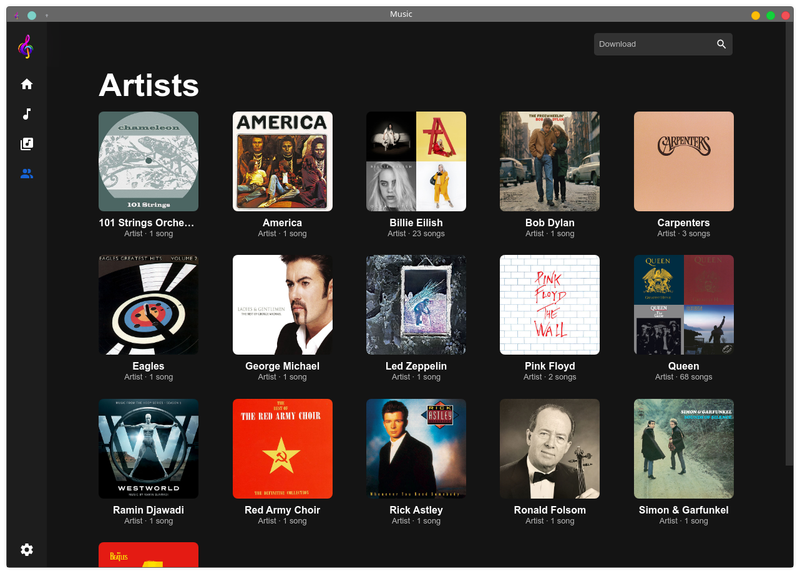

<div align="center">
  
</div>

# Music

Download and play songs from your phone. <br>
Optionally you can sync with firebase, allowing easy use of multiple devices.

Go [here](#download-and-installation) for installation.

### Easily play and download songs

<div align="center">
   
</div>

<br>

### View all songs and by artists

<div align="center">
   
</div>

<br>

### Automatically generated albums as well as Custom ones

<div align="center">
   
</div>

<br>

### Shuffle and view queue

<div align="center">
  
</div>

> This app is the desktop version of [this app](https://github.com/Lutetium-Vanadium/Music-Flutter).

If you have any issues or suggestions, feel free to [open a pull request](https://github.com/Lutetium-Vanadium/music-vue/pulls) or [file an issue](https://github.com/Lutetium-Vanadium/music-vue/issues)

If you wish to customize or learn more about the project, go [here](docs/codestructure.md).

## Download and Installation

### TODO

### Api keys

The app requires [A Napster API Key](https://developer.napster.com/api/v2.2#getting-started), to function. You can also optionally add [Firebase](https://firebase.google.com/) for syncing.

Steps to create the API Keys can be viewed [here](docs/apikeys.md).

Once you have those created, you can move onto running the app.
You will need to enter the api keys directly in the app.

### Build Dependecies

You will need node and yarn for this project. Run:

```sh
yarn install
```

This will install dependecies.

### Running without a regular installation

If you wish to test the app to see if it works run:

```sh
yarn dev
```

This will open it in developer mode, with devtools open.

### Building

#### OS Specific Config:

Linux:

- Depending on your system package manager, `vue.config.js`, change the linux target to `deb`, `rpm`, `freebsd`, `pacman`, `p5p`, `apk`.
  You can also build to `AppImage`, `7z`, `zip`, `tar.xz`, `tar.lz`, `tar.gz`, `tar.bz2`, `dir`.

#### Build Command

```sh
yarn build
```

This builds the project and creates a release folder, with the appropriate format.

> The app hasn't been tested on Mac and Windows, there might be some bugs, related to building the project as well as running it. Please report [open a pull request](https://github.com/Lutetium-Vanadium/music-vue/pulls) or [file an issue](https://github.com/Lutetium-Vanadium/music-vue/issues) to fix the issue.
