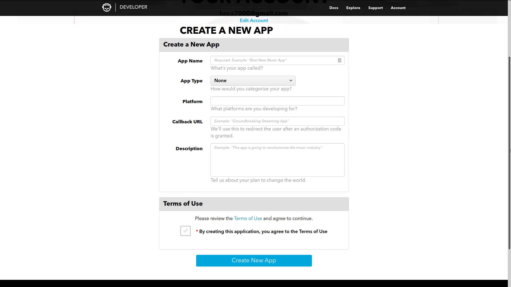
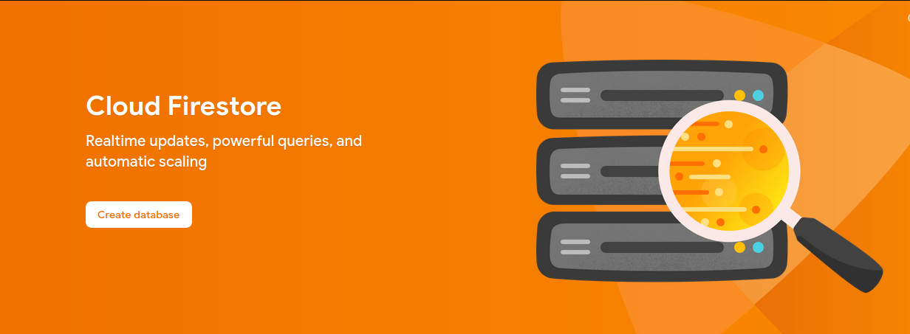
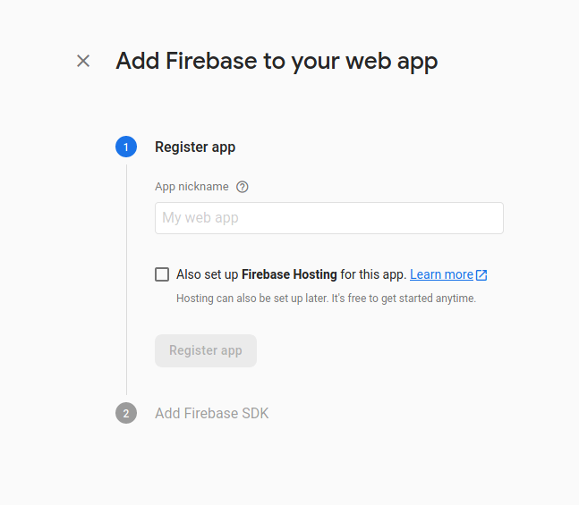

# Api Keys

- [Napster](#napster)
- [Firebase](#firebase-optional)

## Napster

[The API provided by Napster](https://developer.napster.com/api/v2.2#getting-started) is used to get metadata about songs that you download. It is also used to provide search results for when you are downloading songs.

> The Napster API allows upto 500 calls per second, after which it returns a `429: Too Many Requests`, but its extremely unlikely you will exceed that.

To get the API key, go to [napsters developer website](https://developer.napster.com/developer), create an account and click "Add New App". It will redirect to you a page like this:



You can add any dummy data you want, since auth is not used, the callback url is never used and can be set to anything.

After creating the new app, it may take some time for them to approve your app, once the status is approved, it should show the API Key which is what is needed during set up of the app.

## Firebase (optional)

All data about the songs and albums are stored locally in an sqlite database, but if you want to use the app on multiple devices, downloading songs twice can become annoying. During set up, you can optionally provide some [Firebase](https://firebase.google.com/) API details, to take advantage of [Firestore](https://firebase.google.com/products/firestore) for syncing.

> Firestore allows upto 50,000 reads, 20,000 writes and 20,000 deletes per day under the free tier, since it is only used for syncing, chances are you won't exceed the free tier.

Once you sign in to firebase with google, go to the [console](https://console.firebase.google.com/u/0/), and add a project.

Once the project is created, navigate to the database tab (on the left under Develop).



Click **Create database**. Select **Start in production mode**. [Choose a location](https://firebase.google.com/docs/projects/locations?authuser=0#location-r) which is closest to you, then click Done.

> The location is not editable, so make sure to choose the right option.

Go to the **Rules** tab and update the rules to the following:

```
rules_version = '2';
service cloud.firestore {
  match /databases/{database}/documents {
    match /{document=**} {
      allow read, write: if true;
    }
  }
}
```

> This allows anyone with the API Key to read and make changes to the firestore database, so keep the keys secret. The way the app is built, each user is supposed to have their on firestore database.

Then click publish. Go back to project overview and then press **Add App**, and choose web.



You can set the app nickname to anything. Click Register app.

```html
<script src="https://www.gstatic.com/firebasejs/7.19.0/firebase-app.js"></script>

<script src="https://www.gstatic.com/firebasejs/7.19.0/firebase-analytics.js"></script>

<script>
  var firebaseConfig = {
    apiKey: '...', // apiKey - This is required
    authDomain: '...',
    databaseURL: '...',
    projectId: '...', // projectId - This is required
    storageBucket: '...',
    messagingSenderId: '...',
    appId: '...', // appId - This is requireed
    measurementId: '...',
  };

  firebase.initializeApp(firebaseConfig);
  firebase.analytics();
</script>
```

Copy the `apiKey`, `projectId` and `appId`, as annotated in the above snippet, these will be used to connect to firestore.
